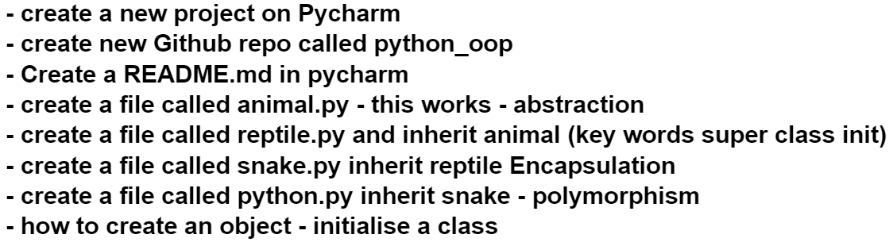
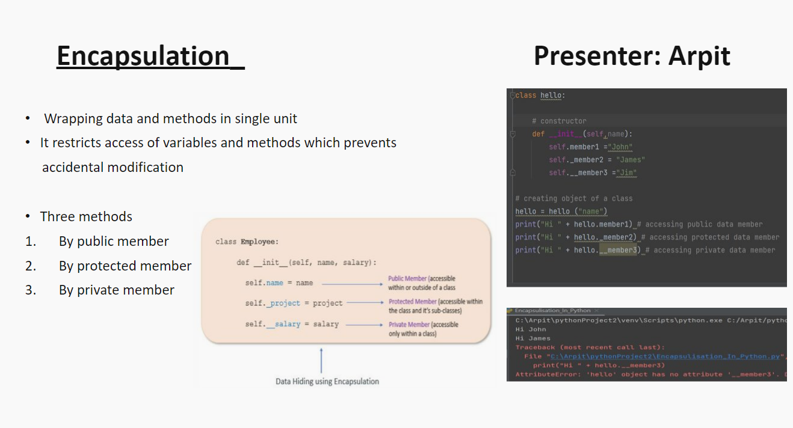

# Python OOP



#### Step 1
```python
# create an Animal class
# syntax class Name:

class Animal:

    # __init__ to declare class attributes
    def __init__(self): # self refers current class
        self.alive = True
        self.spine = True

    def sleep(self):
        return "8 hours sleep is advised.."

    def eat(self):
        return "eat if you like to stay alive... and eat healthy "

# create an object of the class before using it
cat = Animal()

print(cat.eat()) # abstracted how was eat created or what info is available
```
Step 2
```python
# inherit everything from Animal class into reptile
from animal import Animal

# create a reptile class
class Reptile(Animal): # write the name of the class in (parent-class) to inherit
    # parent class - base class supper class

    def __init__(self):
        # to let it know to inherit everything from parent class
        super().__init__() # super is used to inherit everything from base class
        self.cold_blooded = True
        self.heart_chambers = [3, 4]

    def seek_heat(self):
        return "looking for the sun shine "

    def hunt(self):
        return "working hard to catch a next meal "

# create object of reptile class

reptile_object = Reptile()

#print(reptile_object.eat())
#print(reptile_object.hunt())
# let's move onto Encapsulation

```

##### Step 3

```python
# inherit reptile from Reptile class

from reptile import Reptile

class Snake(Reptile):

    def __init__(self):
        super().__init__()
        self.forked_tongue = True

    def _use_tongue_to_smell(self):
        return "Protected - I can use my tongue to smell food"

    def __use_tongue_to_smell(self):
        return "Protected - I can use my tongue to smell food"

snake_object = Snake()

print(snake_object.eat()) # this function is inherited from Animal
print(snake_object.seek_heat()) # This function is inherited from Reptile class
print(snake_object._use_tongue_to_smell())
print(snake_object.__use_tongue_to_smell())

```
```python

Traceback (most recent call last):
  File "C:\Users\ahskhan\PycharmProjects\eng122_oop\snake.py", line 21, in <module>
    print(snake_object.__use_tongue_to_smell())
AttributeError: 'Snake' object has no attribute '__use_tongue_to_smell'

```